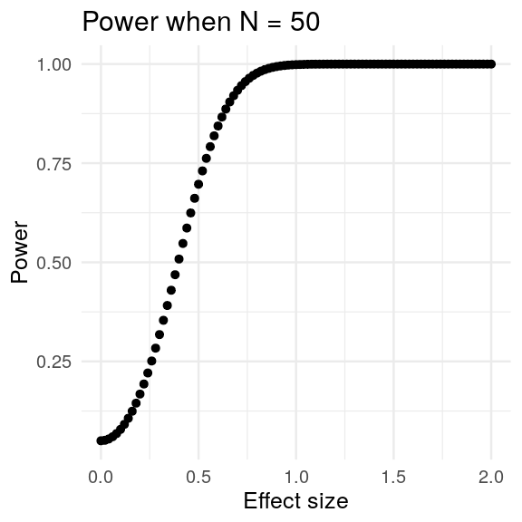

Power calculations for mouse research
========================================================
author: Thomas G. Stewart, PhD
date: 13 August 2019
autosize: true
width:1024
height:768
transition: fade
transition-speed: fast

These slides were prepared for the 2019 Vanderbilt Mouse Kidney Injury Workshop [(link)](https://www.mc.vanderbilt.edu/vckd/events/2019/workshop/) on 13 August 2019.

Slides
======

  
These slides are available on my faculty page under **Teaching**
   
<h2>tgstewart.xyz</h2>

The goals of this session are to
========================================================
- provide a big picture overview of power calculations
- explain when power calculations are (and are not) appropriate
- introduce online resources for power calculations
- work through **hands-on** examples of calculating power

========================================================

## The big picture

========================================================

## The big picture for an **hypothesis driven, confirmatory study**

========================================================

## The big picture **for an hypothesis driven, confirmatory study**

========================================================

## The big picture **for an hypothesis driven, confirmatory study**

## How does a **confirmatory study** compare to a **pilot study** or an **exploratory study**?

Hypothesis driven vs pilot study
========================================================

Hypothesis driven vs exploratory study
========================================================

========================================================
   
# The **deliverables** of your proposed study should match the type of study you are performing

Deliverables
========================================================

| Pilot | Exploratory | Confirmatory |
|:-----:|:-----------:|:------------:|
| Demonstration of logistical capability | Hypotheses for future research | Tested hypotheses, usually resulting in |
| Collection of preliminary data | | + Conclusive difference |
| Go/No go decision about next stepᵃ | | + Conclusive similarity |
| | | + Inconclusive result |

ᵃ This is different from an hypothesis test

Helpful advice for pilot studies
========================================================

========================================================

## For the remainder of the presentation, we are going to focus on hypothesis driven studies.

========================================================
type: prompt
incremental: true

Important side note about hypothesis driven studies

 
As an example, consider a comparison of means between two groups.

***

   What is the interpretation if  p< 0.05?

What is the interpretation if  p > 0.05?

Important side note
========================================================
type: prompt
incremental: true

Important side note
========================================================
type: prompt
incremental: true

### It is a mistake to say: *There was no difference in mean Y between groups.*

### It is correct to say: *At the given sample size, a difference in mean Y was not detected.*

### It is cutting-edge to use **a second-generation p-value** and to prespecify a meaningful **null region**.

========================================================
type: prompt

   

## Important side note over

Back to the big picture
========================================================

## &nbsp;

Big picture
========================================================

## Suppose one knew the truth

Note that the ? changes to A.

Big picture
========================================================
incremental: true

## Suppose one repeated the study multiple times

***

## Would one get the same result each time?

   

# **Probably** not

Big picture
========================================================
incremental: false
transition: none

## Suppose one repeated the study multiple times

***

## Would one get the same result each time?

   

# **Probably** not

Key vocabulary
========================================================

# **Operating characteristic:**

## The distribution of a study trait over repeated executions of the study.

Types of study traits
========================================================

1. Sample size
1. False positive rate
1. False negative rate
1. False direction rate
1. Cluster stability

Possible study traits
========================================================

1. Sample size
1. False positive rate  **(Type I error)**
1. False negative rate  **(Type II error)**
1. False direction rate  **(Type S error)**
1. Cluster stability

Type I error
========================================================

Type I error
========================================================

Type I error
========================================================

Type I error
========================================================

Type I error
========================================================

Type II error
========================================================

Type II error
========================================================

Type II error
========================================================

Type II error
========================================================

Type II error
========================================================

Type II error
========================================================

Operating characteristics
========================================================
incremental: true
  
## Who cares about **operating characteristics**?

### A **researcher** should understand the sample size needed for a study to generate conclusive results.

### Operating characteristics are helpful quantities for **grant reviewers** and **funding agencies** and anyone who must judge the likelihood that a study will generate conclusive results within budget.

### **Data scientists** calculate operating characteristics to understand the performance of a proposed analysis method.

Operating characteristics
========================================================
incremental: true
  
## When should we care about **power**?

### **Grant reviewers** generally prefer to fund projects that will lead to conclusive results.

### **Data scientists** prefer that study analysis plans use methods that maximize power.

Operating characteristics
========================================================
incremental: true
  
## When should we NOT care about **power**?

### After the data is collected.

### After the analysis has been performed.

Post-Hoc Power Is Not A Thing
========================================================

## Helpful resource: **DATAMETHODS.org**

How to calculate power
========================================================

1. Simulation (prefered, for simple and complex study designs)
2. Calculators (for simple designs)

Simulation
========================================================

Simulation
========================================================

Simulation
========================================================

Simulation
========================================================

Needed Information:

1. Study design
1. Analysis plan
1. Approximate distribution of primary outcome
1. Approximate distribution of primary exposure
1. Parameters of interest (N, effect size, etc.)

Power calculators (for simple study designs)
========================================================

Needed Information:

1. Study design
1. Analysis plan
1. Mean and SD of primary outcome
1. Parameters of interest (N, effect size, etc.)

Online calculators (for simple study designs)
========================================================

1. Sealed Envelope: https://www.sealedenvelope.com/
1. SWOG Stat: https://stattools.crab.org/
1. Sample Size.net: https://www.sample-size.net/

How to present power
========================================================

## Fix N

How to present power
========================================================

## Fix the effect size

How to present power
========================================================

## Fix the power

Hands-on (simple study designs)
========================================================

1. **How many** subjects are required to have a 90% chance of detecting, as significant at the 5% level, a decreased mortality rate from 45% in the control group to 25% in the experimental group.

2. With 25 subjects in each group, **what is the minimal detectable difference** in mean creatinine at 90% power when α = 0.05 and SD = 1.
