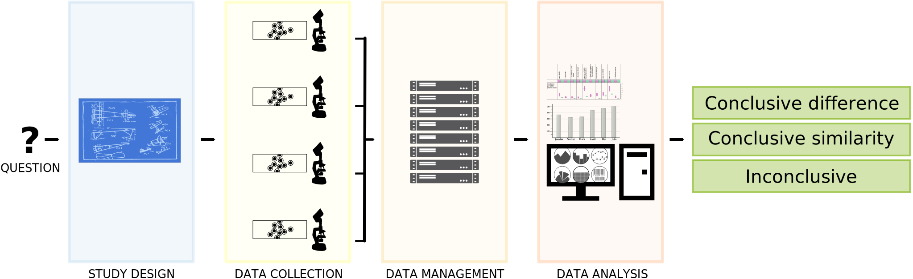

Power calculations for mouse research
========================================================
author: Thomas G. Stewart, PhD
date: 13 August 2019
autosize: true
width:1024
height:768
transition: fade
transition-speed: fast

These slides were prepared for the 2019 Vanderbilt Mouse Kidney Injury Workshop [(link)](https://www.mc.vanderbilt.edu/vckd/events/2019/workshop/) on 13 August 2019.

Slides
======

  
These slides are available on my faculty page under **Teaching**
   
<h2>tgstewart.xyz</h2>

The goals of this session are to
========================================================
- provide a big picture overview of power calculations
- explain when power calculations are (and are not) appropriate
- introduce online resources for power calculations
- work through **hands-on** examples of calculating power

The big picture
========================================================

The big picture
========================================================
transition: none

The big picture for an hypothesis driven, confirmatory study
========================================================
transition: none
incremental: true

# How does this compare to a pilot study or an exploratory study?

Pilot study
========================================================
transition: none
incremental: true

Important side note
========================================================
type: prompt
incremental: true

As an example, consider a comparison of means between two groups.

***

What is the interpretation if $\ p < 0.05$?

What is the interpretation if $\ p > 0.05$?

Important side note
========================================================
type: prompt
incremental: true

Important side note
========================================================
type: prompt
incremental: true

### It is a mistake to say: *There was no difference in mean Y between groups.*

### It is correct to say: *At the given sample size, a difference in mean Y was not detected.*

### It is cutting-edge to use **a second-generation p-value** and to prespecify a meaningful **null region**.

========================================================
type: prompt

   

## Important side note over

Back to the big picture
========================================================

## &nbsp;

Big picture
========================================================

## Suppose one knew the truth

Big picture
========================================================
incremental: true

## Suppose one repeated the study multiple times

***

## Would one get the same result each time?

   

# **Probably** not

Key vocabulary
========================================================

# **Operating characteristic:**

## The distribution of a study trait over repeated executions of the study.

Types of study traits
========================================================

1. Sample size
1. False positive rate
1. False negative rate
1. False direction rate

Possible study traits
========================================================

1. Sample size
1. False positive rate  **(Type I error)**
1. False negative rate  **(Type II error)**
1. False direction rate  **(Type S error)**

Type I error
========================================================

Type I error
========================================================

Type I error
========================================================

Type II error
========================================================

Type II error
========================================================

Type II error
========================================================

Type II error
========================================================

Operating characteristics
========================================================
incremental: true
  
## Who cares about **operating characteristics**?

### A **researcher** should understand the sample size needed for a study to generate conclusive results.

### Operating characteristics are helpful quantities for **grant reviewers** and **funding agencies** and anyone who must judge the likelihood that a study will generate conclusive results within budget.

### **Data scientists** calculate operating characteristics to understand the performance of a proposed analysis method.

Operating characteristics
========================================================
incremental: true
  
## When should we care about **power**?

### **Grant reviewers** generally prefer to fund projects that will lead to conclusive results.

### **Data scientists** prefer that study analysis plans use methods that maximize power.

Operating characteristics
========================================================
incremental: true
  
## When should we NOT care about **power**?

### **Grant reviewers** generally prefer to fund projects that will lead to conclusive results.

### **Data scientists** prefer that study analysis plans use methods that maximize power.

